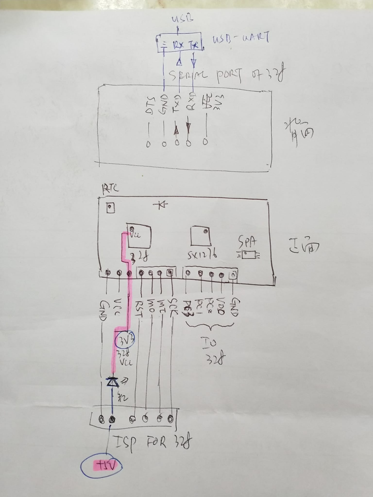
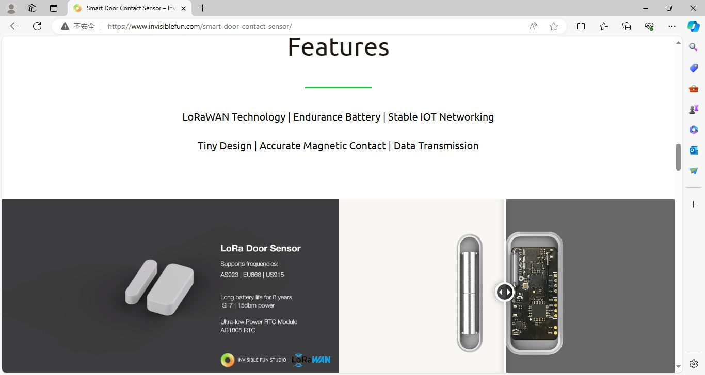
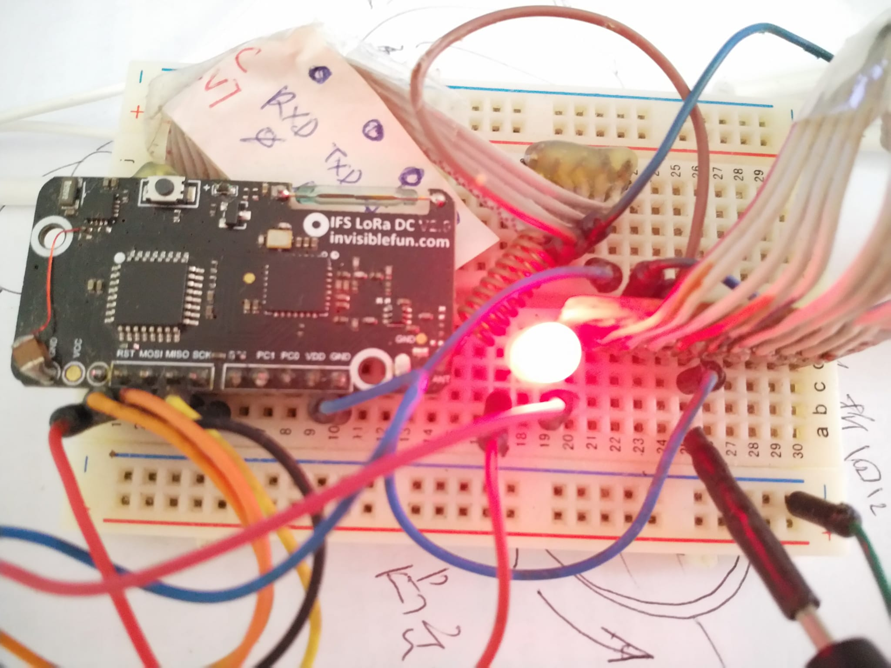
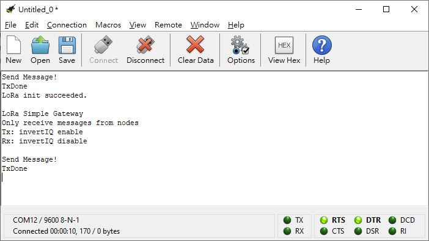
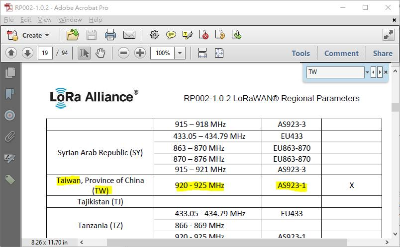

# AVR_IFS_LoRa_simpleGateway_tseting  
LoRa SX1276 simpleGateway testing  
PCB version 2.0  
changed design for 3.3V supply rail  
  
  

### Disclaimer,

all those materials in presenting of this repository, either own creation or downloaded from the internet, no affiliation to the manufacturer or their designer.
hardware  
LED @ PD5, MCU pin9  
reed switch @ PB0, MCU pin12  
IO, PC3 / PC1 PC0 or ADC3 / ADC1 / ADC0  

the board and generic info.  
[https://github.com/xiaolaba/AVR_IFS_LoRa_328PB_testing?tab=readme-ov-file](https://github.com/xiaolaba/AVR_IFS_LoRa_328PB_testing)

ISP and serial port connection.
9600 baud, N81
5V supply and 3.3V to target board, a simple RED LED as voltage step down convertor.
  
  

### design/testing files  
  
  
  
  

  
  

 
